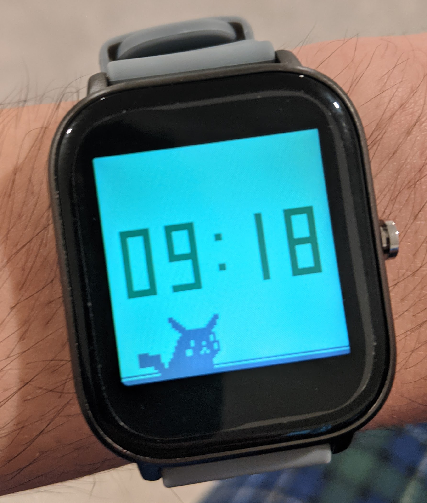
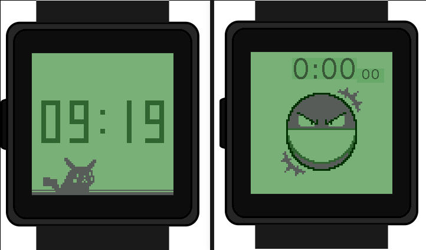

# Pokétch-os

Pokétch-os is a fork of [wasp-os](https://github.com/daniel-thompson/wasp-os), an open source firmware for nRF52-based smart watches. It reskins watch applications to emulate those found in the [Pokétch](https://bulbapedia.bulbagarden.net/wiki/Pok%C3%A9tch), a digital watch given to players in the 4th generation Pokémon games.

To install, you can follow the [wasp-os installation guide](https://wasp-os.readthedocs.io/en/latest/install.html). I've only tested this for the P8 watch.

Currently, I've only themed the digital watch and stopwatch applications. Now that I've gotten over the initial hurdle of building watch apps and uploading them to the hardware, in the future I'd like to expand on this project and create my own apps in the spirit of those found in the game.